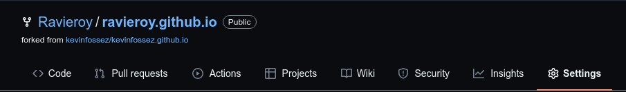
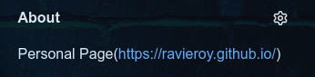
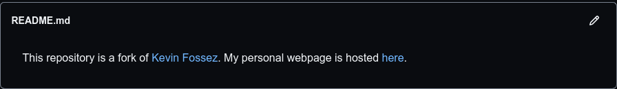
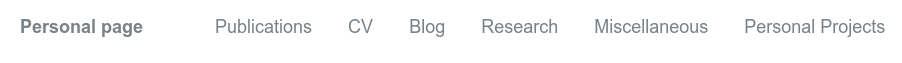

This repository is a fork of [Kevin Fossez](https://github.com/kevinfossez/kevinfossez.github.io). My personal webpage is hosted [here](https://ravieroy.github.io/).

### This blog details the contents of all the files necessary to make the GitHub page. I will also explain where the changes has to be made inorder to make the website your own. You can make these changes either from the Github website itself or you can do these changes locally and push the changes on your hithub.
----

#### The first thing you would like to have is your preffered name for your repository which in this case is also link to your website. Right now, if you have cloned from my github, you will see my *ravieroy.github.io* in your repository name. Click on the settings (as shown below) and change the name to your desired name. 

#### So now we have your website ready but with my details. Let us first start with the "About" section of the page. Here you would like to give link address to your page from the previous step.

#### Before we get into the making more important changes, lets start with something simple. We update the README.md file first. It is a simple markdown file whose contents will be displayed in this github repo(not in your website _yourname.github.io_). You can learn basic markdown syntax [here](https://www.markdownguide.org/basic-syntax/) .

----
#### Now we are done with the basic stuffs. Now we go deeper into the files and make some site-defining changes. Remember the changes made is not reflected immediately in the website . You might have to wait couple of minutes, so do not worry. After making changes to specific files let the changes reflect correctly in your website. If something goes wrong and you so something fishy, revert back the changes.  

----

**_config.yml** :  _This is a config file which will affect your whole site. Most probably you will only have to make change once and you will be done with it. The following are the sections you would like to make changes. They are self-explanatory._

***Leave or make the entry empty if you do not want to display it. Leave things as it is if you do not know what it does.***

- Site Settings
  - name 
  - description
  - url
  - repository
- Site Author
  - name 
  - avatar : You have to put your profile picture in the _images_ folder with name **profile_pic.jpg**
  - bio
  - location
  - github
  
----
**_data** : _This is a folder and the only file you would want to make changes(in the beginning) is **navigation.yml**. It contains the pages you would like to show in your website(see below image). Remember every section you see here has a corresponding markdown file in the folder **_pages**, so if you add/delete or modify a page, make sure you do the same in the **_pages** folder as well. For example CV is stored in CV.md, Publications is stored in publications.md and so on_.

---

**_pages** : _This folder contains majority of what you see on your page. Like explained earlier, every page(on your website) has a corresponding markdown file in this folder. You have to edit those specific files in correct format according to your need. Say you want to save your CV. Head over to the CV.md file and update it according to your need. Similarly, if you want to make changes to say a new section you have added then edit the file corresponding to that section of your page_

_This folder also contains another folder named **mypages** which contains a set of markdown files which are opened in the **Miscellaneous** section of the website. The link to these files are in the misc.md file. So say you want to add a link to a text then you make the markdown file and keep it it in **mypages** folder and later link it back. See the misc.md file to under it better_

---
**_posts** : _This is yet another important section of your website. It contains similar to earlier examples, a markdown file which serves as your blog post. So say you want to write a blog post, all you have to do is write it in markdown format like you have been doing till now and just make some formatting changes and rename the file in the format **YYYY-MM-DD-Title of your blog post.md**._

---
**images** : _This is the folder which contains images for your posts, profile and everything else. Just use this folder to store the image you are using anyhwere in your website and put the path of the image_.

#### These are enough for your website to get started and look like yours. You can make further changes according to your need and expertise. Hope this helps.
