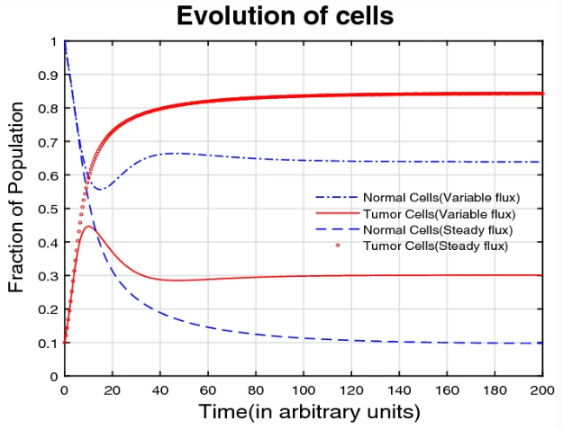
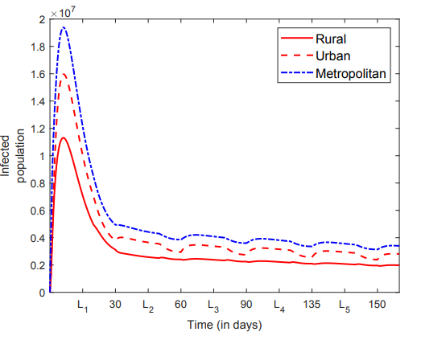



## Selected works

### Immunomodulatory role of black tea in the mitigation of cancer induced by inorganic arsenic

**R. Kiran**, Swati Tyagi, Syed Abbas, Madhumita Roy and A. Taraphder 
  _Immunomodulatory role of black tea in the mitigation of cancer induced by inorganic arsenic_
  Eur. Phys. J. Plus (2020) 135: 735 [[article]](https://link.springer.com/article/10.1140%2Fepjp%2Fs13360-020-00766-1)
  [[arxiv]](https://arxiv.org/abs/2005.13489) 

We present a model analysis of the tumor and normal cell growth under the influence of a carcinogenic agent, an immunomdulator (IM) and variable influx of immune cells including
relevant interactions. The tumor growth is facilitated by carcinogens such as inorganic arsenic while the IM considered here is black tea (Camellia sinesnsis). The model with variable influx of immune cells is observed to have considerable advantage over the constant influx model, and while the tumor cell population is greatly mitigated, normal cell population remains
above healthy levels. The evolutions of normal and tumor cells are computed from the proposed model and their local stabilities are investigated analytically. Numerical simulations
are performed to study the long term dynamics and an estimation of the effects of various factors is made. This helps in developing a balanced strategy for tumor mitigation without
the use of chemotherapeutic drugs that usually have strong side-effects

### Population Migration and COVID  

**R. Kiran**, Madhumita Roy, Syed Abbas and A. Taraphder 
  _Effect of population migration and punctuated lockdown on the spread of infectious diseases_
  Nonauton. Dyn. Syst. 2021; 8:251-266 [[article]](https://www.degruyter.com/document/doi/10.1515/msds-2020-0137/html)
  [[arxiv]](https://arxiv.org/abs/2006.15010) 

One of the critical measures to control infectious diseases is a lockdown. Once past the lockdown stage in many parts of the world, the crucial question now concerns the effects of relaxing the lockdown and finding the best ways to implement further lockdown(s), if required, to control the spread. With the relaxation of lockdown, people migrate to different cities and enhance the spread of the disease. This work presents the population migration model for n-cities and applies the model for migration between two and three cities. The reproduction number is calculated, and the effect of the migration rate is analyzed. A punctuated lockdown is implemented to simulate a protocol of repeated lockdowns that limits the resurgence of infections. A damped oscillatory behavior is observed with multiple peaks over a period.

