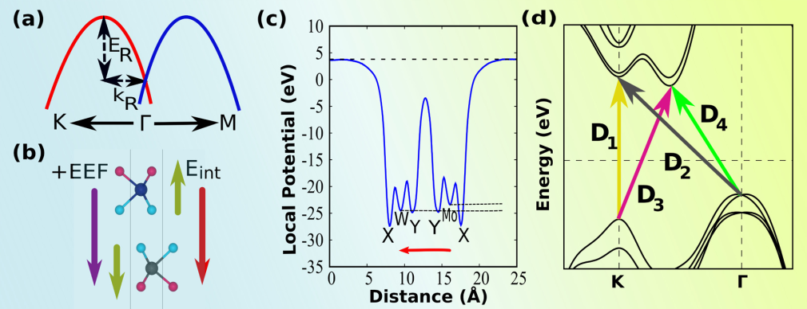



## Selected works

### Electric field and strain-induced band-gap engineering and manipulation of the Rashba spin splitting in Janus van der Waals heterostructures

**Shubham Patel**, Urmimala Dey, Narayan Prasad Adhikari and A. Taraphder 
  Physical Review B [[article]](https://journals.aps.org/prb/abstract/10.1103/PhysRevB.106.035125)
  [[arxiv]](https://arxiv.org/abs/2112.15457) 

The compositional as well as structural asymmetries in Janus transition metal dichalcogenides (J-TMDs) and their van der Waals heterostructures (vdW HSs) induce an intrinsic Rashba spin splitting. We investigate the variation of band gaps and the Rashba parameter in three different Janus heterostructures having AB-stacked MoXY/WXY (X, Y=S,Se,Te;X≠Y) geometry with a Y−Y interface, using first-principles calculations. We consider the effect of external electric field and in-plane biaxial strain in tuning the strength of the intrinsic electric field, which leads to remarkable modifications of the band gap and the Rashba spin splitting. In particular, it is found that the positive applied field and compressive in-plane biaxial strain can lead to a notable increase in the Rashba spin splitting of the valence bands about the Γ point. Moreover, our ab initio density functional theory (DFT) calculations reveal the existence of a type-II band alignment in these heterostructures, which remains robust under positive external field and biaxial strain. These suggest novel ways of engineering the electronic, optical, and spin properties of J-TMD van der Waals heterostructures holding a huge promise in spintronic and optoelectronic devices. Detailed k⋅p model analyses have been performed to investigate the electronic and spin properties near the Γ and K points of the Brillouin zone.

