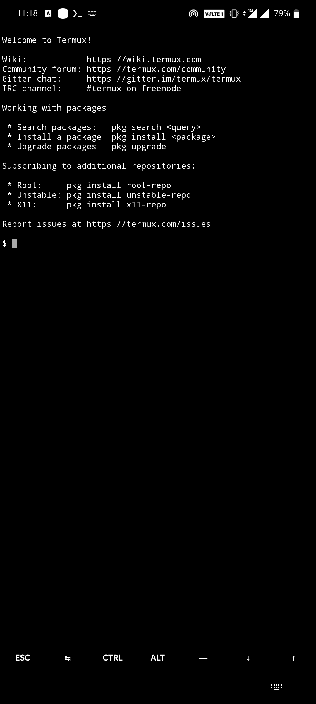
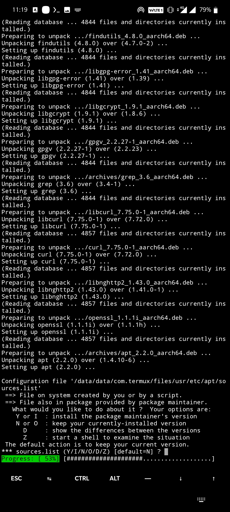

---                                                                                                                                                                                                             
title: 'Android Tips-Part-1'
date: 2022-01-15
permalink: /posts/2022/01/blog-post-1/
tags:
  - android
  - linux
---

# Installing Linux OS on Android platform
----

## Table of Contents

[Why use Linux in Android OS?](#Why-use-linux-in-android-os?)

[Requirements](#requirements)

[Setting things up](#setting-things-up)

[Post installation](#post-installation)

[VNC viewer setup](#vnc-viewer-setup)

[Important Links](#important-links)

[Common errors](#common-errors)

[Final Words](#final-words)

----


## Why use Linux in Android OS?

* Well, you could be just tinkering around and learning stuffs.
* You love terminal functionality of Linux.
* You want to remotely access your device
* You might want to learn linux but don't have access to laptop or computer.

For whatever reason you might want to do this, this guide will help you do that. This will let you use the full power of **Linux** on your Android device, and not just terminal(for which **Termux** is the best) . Needless to say that, the best experience of using this will be on Android Tablets due to their large screen size.

----

## Requirements

1. [Termux](https://play.google.com/store/apps/details?id=com.termux&hl=en_IN&gl=US)
- It is an android terminal emulator app which works directly with no rooting or setup required. It is quite handy tool to have in android smartphones. 

2. [Andronix](https://play.google.com/store/apps/details?id=studio.com.techriz.andronix&hl=en_IN&gl=US)
- This app lets you install Linux system on your android device without root. There are several distros you can install easily and for free, although there are modded paid versions of distros as well. You can install Ubuntu, Kali, Debian, Arch, Manjaro, Fedora, Void and Alpine. 

3. [VNC Viewer](https://play.google.com/store/apps/details?id=com.realvnc.viewer.android&hl=en_IN&gl=US)
- This turns your phone into a remote desktop, giving instant access to your system.

----

## Setting things up

Once you have installed all the three apps, we can begin.

This is how Termux looks when first started. It uses `pkg` as its package manager. 



Run `pkg upgrade ` to update the system. At one point you would be asked about configuration files. I would recommend to go with the default options here. This will take around 2 minutes to complete.



Once the update is finished, go ahead and open **Andronix**. You will be able to choose your preffered distro here. For this guide I am choosing Manjaro XFCE. 


Click on install


Choose what version or distro you want to install. When you click on the version, a text will be copied in your clipboard. 


Open Termux and paste it there and press ENTER.


Now you have to wait. Everything is automated from here and it can take upto 20 - 25 minutes to complete the setup. You should be connected to internet and this whole process will take around 500MB of your internet data.

***Important: You might have to allow Termux for access to storage while the setup. If it asks for it, just press allow.***

---

## Post installation

Once the installation is finished, restart Termux. If you do an ```ls``` You should see an executable file named ***start-xxxx.sh***. In my case it is ***start-manjaro.sh***.


Run the following command

```bash
./start-xxxx.sh #replace xxxx with whatever is the name
```


Now you should be running as root in the localhost. Now we start the vnc server by ```vnc-server start```. 
***Important: At this point you might get a pop up like shown below for choosing the screen resolution. Just keep them at autodetct/dynamic and you are okay.***


If you are doing for the first time, you will be asked to setup password for the vnc viewer. This password will be required later to view the desktop, so make sure you remember it.


Next, it will ask if you want to set a password for view only. This will restrict you to make any changes. You can set it or just press n and go ahead.


Once you are done, vnc server would be running with the remote desktop as localhost:1


---

## VNC viewer setup

Now open vnc viewer and go through the setup for the first time.


Press the + icon to add a new connection and input ```localhost:1``` in the address and give a name as you wish.


You should have something like this now. Press connect


Enter the password you have setup before. You can remember the password if you want.


Once you press continue, you should immediately see the homescreen of your distro. It works best in landscape mode with external keyboard and mouse. Since it is touch enabled, you can easily navigate around and work like you work on a Linux system. 

Here are few screenshots of the Manjaro XFCE edition.


----

## Important Links

1. [Youtube Tutorial](https://www.youtube.com/watch?v=jvuufPWKF3k&t=496s)
- This is a nice video tutorial on installing Linux on android. Since the video is bit old, the process has changed slightly but you will get the idea if you pair the steps in the video with the above guide.

2. [FAQ on Andronix](https://andronix.app/faq-frequently-asked-questions/)
- This is a handy link to keep as it contains all the necessary commands required to run Linux. 


## Common errors

While starting the vnc server by `vncserver-start` you can get some errors like shown below.

1. ***Warning: localhost:1 is taken because of /tmp/.X1-lock*** and/or ***Warning: localhost:1 is taken because of /tmp/.X11-unix/X1***


To correct this simply delete the file and restart the server. To go into the folder type `cd /tmp ` and to list the files `ls -al`. To delete use `rm file_name`

Onced one simply restart vnc server by `vncserver -start`

2. **You forgot your vnc password or were not asked to set up one**

Simply set up new password by `vncpasswd` and use this for the set up.


## Final Words

Linux is a great OS and everyone should learn it and use it. Don't let your system restrictions stop you from using it. It might not be ideal to use linux this way, but you will get the first hand experience of this. Don't worry about breaking stuffs because you won't, and even if you do, I am sure you can get it back. Thats the beauty of it. Try any disro you want and get the feel of it.


